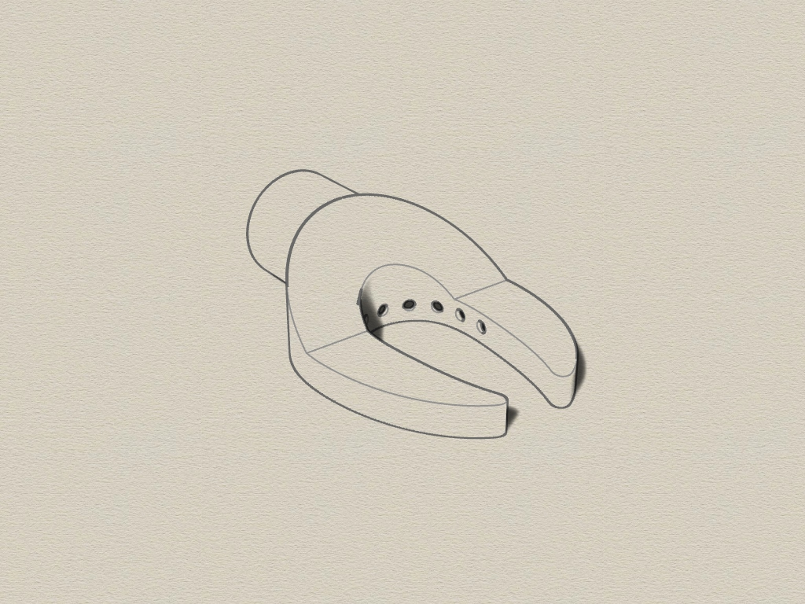

# Drilling-dust-adapter for Siemens Z7 vacuum cleaner
3D printable drilling dust adapter for Siemens Z7 vacuum cleaner (STL file created with Rhino 6).

The adapter is self-adhesive on the wall by vacuum.

## 3D adapter
The adapter consists of 1 parts which can plugged on the vacuum cleaner pipe.

Requirements:
* 3D printer 
* Filament of your choice

## View
 
 
 
 
 
